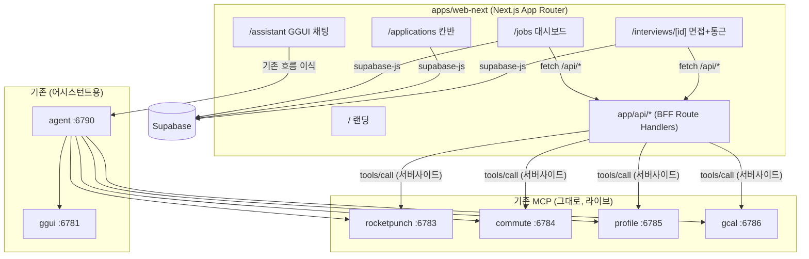

# PRD v2 — JobPilot 채용 웹서비스 (Next.js 재빌드)

> 제작: **channs 단독 (솔로 빌드)** · 2026-05-31 · GGUI Track Award 주력
> 목표: "GGUI 채팅 셸"에서 **"진짜 쓸 수 있는 채용 웹서비스"**로 재빌드. 메인은 직접 만든 Next.js 채용 UI(랜딩/대시보드/칸반/면접뷰), GGUI는 **보조 AI 어시스턴트**로 임베드.
> Ralph 빌드용 스펙. 매 이터레이션 이 문서 + docs/RALPH-HARNESS-RULES.md 읽음.

---

## 0. 핵심 결정 (사용자 확정)
| 항목 | 결정 |
|---|---|
| **스택** | **Next.js (App Router) 신규** — `apps/web-next` 새로 생성. Tailwind + 직접 컴포넌트 |
| **화면** | **전부 4개** — 랜딩(/) + 공고 대시보드(/jobs) + 지원 칸반(/applications) + 면접·통근 상세(/interviews/[id]) + 어시스턴트(/assistant) |
| **GGUI** | **보조 어시스턴트** — 메인은 직접 만든 UI가 처리, GGUI는 사이드 패널 채팅. ⚠️단 트랙 방어용 "실시간 생성 한 방"은 데모에 필수(§3) |
| **DB** | **Supabase 실연동** — profiles/applications/interviews 영속 (cacrjgioedkwxqhxiqbn) |
| **데이터 경로** | 공고/통근/날씨 = **Next.js API Route(BFF)가 MCP 직접 호출** (LLM 우회). 어시스턴트만 agent(LLM) |
| **크레딧** | channs 단독 — 랜딩 푸터/About/README/제출폼/어시스턴트 인사 |

## 0.1 절대 원칙 — 기존 GGUI 데모 보존
새 Next.js 앱은 **별도 디렉토리(`apps/web-next`)**로 만든다. 기존 `apps/web`(Vite GGUI 데모)은 **건드리지 않고 그대로 보존** → 폴백 데모로 항상 살아있음. 새 앱이 완성되면 그게 메인, 기존은 비상용.

---

## 1. 아키텍처



**두 경로:**
- **결정적(메인)**: 화면 → Next.js API Route → MCP `tools/call` (서버사이드, LLM 없음, 빠름·무료·결정적·CORS/키 안전)
- **에이전틱(보조)**: /assistant → agent → ggui+MCP (GGUI 트랙용)

### 왜 Next.js API Route가 BFF인가
별도 BFF 서버 안 만들어도 됨 — **Next.js의 `app/api/*` Route Handler가 서버사이드**라 거기서 MCP를 직접 호출하면 CORS·키노출 자동 해결. 공고/통근/날씨는 LLM 거치면 느리고 비싸고 비결정적(이전 searchQuery 렌더 에러 경험) → API Route가 MCP 직접 호출해 평범한 JSON 반환.

### API Route → MCP 호출 골격
```ts
// apps/web-next/app/api/_mcp.ts (서버 전용)
const MCP = { rocketpunch:'http://localhost:6783/mcp', commute:'http://localhost:6784/mcp',
  profile:'http://localhost:6785/mcp', gcal:'http://localhost:6786/mcp' };
const ALLOWED = { rocketpunch:['search_jobs','get_job','search_events'],
  commute:['get_commute','get_weather','plan_departure','geocode_place'],
  profile:['match_jobs','parse_resume'], gcal:['create_event'] };

export async function callMcp(server:keyof typeof MCP, tool:string, args:object){
  if(!ALLOWED[server]?.includes(tool)) throw new Error('tool not allowed');
  const r = await fetch(MCP[server], { method:'POST',
    headers:{'Content-Type':'application/json',Accept:'application/json, text/event-stream'},
    body:JSON.stringify({jsonrpc:'2.0',id:1,method:'tools/call',params:{name:tool,arguments:args}})});
  return unwrapMcp(await r.text()); // SSE/JSON 파싱 → structuredContent
}
```
```ts
// app/api/jobs/route.ts
export async function GET(req:Request){
  const q = new URL(req.url).searchParams.get('q') ?? '';
  const data = await callMcp('rocketpunch','search_jobs',{ query:q });
  return Response.json(data);
}
```

### API Route 목록
| Route | → MCP/DB |
|---|---|
| `GET /api/jobs?q&location&exp` | rocketpunch.search_jobs |
| `GET /api/jobs/[id]` | rocketpunch.get_job |
| `POST /api/match` | profile.match_jobs |
| `POST /api/resume` (PDF/text) | profile.parse_resume |
| `POST /api/commute` | commute.get_commute + plan_departure |
| `GET /api/weather` | commute.get_weather |
| `POST /api/geocode` | commute.geocode_place |
| `POST /api/calendar` | gcal.create_event |

### Supabase
- 읽기: 클라이언트 `@supabase/supabase-js` + anon(`sb_publishable_`), apikey 헤더(Bearer 금지)
- 익명 Auth(`signInAnonymously`) + RLS(`auth.uid()=user_id`)로 영속+보안. service_role은 **서버(API Route)에만**, `NEXT_PUBLIC_` 금지.
- 테이블 재사용: profiles/applications/interviews/commute_cache (이미 생성됨)

### 환경변수
```
NEXT_PUBLIC_SUPABASE_URL / NEXT_PUBLIC_SUPABASE_ANON_KEY  (공개 가능)
SUPABASE_SERVICE_ROLE_KEY  (서버 전용, NEXT_PUBLIC 금지)
ANTHROPIC_API_KEY  (어시스턴트만)
MCP_*_URL  (서버 전용)
AGENT_ENDPOINT  (어시스턴트 SSE)
```

### GGUI 어시스턴트 이식
기존 `apps/web/src/Chat.tsx`(agent SSE + AppRenderer + sandboxUrl)를 Next.js로 이식. ⚠️ AppRenderer는 **클라이언트 컴포넌트**(`'use client'`), iframe sandbox라 SSR 주의. `/assistant` 라우트 + 우하단 FAB 패널 양쪽 진입.

---

## 2. UX / 화면 (다크테마, 현 팔레트 계승)

### 디자인 토큰
```
--jp-bg #0d1117 / surface #161b22 / card #21262d / outline #30363d
--jp-fg #e6edf3 / fg-muted #8b949e
--jp-blue-500 #3b82f6 (액션) / blue-400 #60a5fa / blue-600 #2563eb
--jp-error #ef4444 (출발권장 클라이맥스만) / success #3fb950 / warn #d29922 / focus #58a6ff
radius: card 14 / md 8 / pill 999 · 4px 간격 베이스 · Pretendard/system-ui
```
**색만으로 정보전달 금지**: 매칭점수/칸반상태/D-day = 색+수치+라벨+아이콘.

### 전역 AppShell
- 상단바(56px): 로고(→/jobs) · 탭(공고/지원현황) · 우측 "이력서 업로드"
- AI FAB(우하단 56px 원형, blue+glow) → 우측 슬라이드 패널(420px)에 GGUI 채팅. 모바일 풀스크린.
- 모바일<768px: 하단 탭바(공고/지원/AI)

### 화면 1: 랜딩 (/)
히어로("면접 전날 밤, 통근길과 날씨까지 챙기는 AI 채용 에이전트" + "📄 이력서 올리고 시작"(드롭존 겸 CTA) + "공고 둘러보기") → 기능카드 4(매칭/추적/통근+날씨/캘린더) → 작동흐름 스텝(검색→지원→면접→통근) → **푸터 "Made by channs · JobPilot 솔로 빌드"**. CTA 드롭 → 파싱 → /jobs 이동.

### 화면 2: 공고 대시보드 (/jobs) — 앱 홈
좌측(320px): 이력서 상태배너 or 드롭존 + 스킬칩. 우측: 공고 그리드(3열 반응형).
- 컴포넌트: SearchBar(디바운스), FilterChips(직무/지역/경력/재택), ResumeDropzone, JobCard(로고/제목/MatchScoreBadge/태그/지원버튼/💬AI), JobDetailModal
- MatchScoreBadge: 수치+라벨+● (높음≥80 success/보통 warn/낮음 muted)
- 지원하기→Supabase insert→토스트→칸반+1(낙관적). 💬→어시스턴트에 공고 컨텍스트 프리필.
- 상태: 스켈레톤6 / 빈(이력서 유도) / 에러+재시도

### 화면 3: 지원 칸반 (/applications)
4컬럼(지원중/서류합격/면접/최종) @dnd-kit 드래그앤드롭. 카드(회사/직무/지원일 or D-day). 면접 컬럼은 일정+"통근보기".
- 드래그→Supabase status update(낙관적+롤백). 키보드 DnD(Space집기/←→이동) 접근성.
- "면접"이동시 일정 미니폼→interviews insert→D-day.
- 상태: 빈컬럼 점선 / 전체빈("공고에 지원하면")
- 모바일: 가로 스냅 + 상태변경 드롭다운 폴백

### 화면 4: 면접+통근 상세 (/interviews/[id]) ⭐클라이맥스
헤더카드(회사/일시/장소/D-day + 캘린더버튼) → **⭐출발권장 배너(--jp-error, 펄스, 페이지 1순위)** → 2열(통근 택시/지하철/킥보드 카드 3 / 날씨 위젯) → 캘린더(구글/.ics).
- 진입시 /api/commute+/api/weather 자동, plan_departure 자동→배너. 집주소 없으면 1회 입력.
- ⭐배너는 데이터 준비 후 등장(빈 빨강 깜빡임 방지), scale+글로우 모션.
- 통근카드: 추천 모드 ⭐+blue 테두리. 캘린더는 기존 buildGoogleCalendarUrl/downloadIcs 이식.
- 모바일: 배너 sticky top.

### 화면 5: 어시스턴트 (/assistant + FAB)
기존 Chat 이식. 공고/면접 컨텍스트 주입 가능. AppRenderer iframe 격리.

### 접근성: 대비 AAA, :focus-visible 2px, 칸반 키보드 대안, 모달 Esc/트랩, 펄스는 reduced-motion 정지.

---

## 3. ⭐ GGUI 트랙 점수 방어 (보조여도 한 방은 필수)

### 위험 (전략가 경고)
GGUI가 "보조"면 심사위원이 **"그냥 잡보드 + 챗봇 아냐?" → 트랙 점수 붕괴** 위험. 판별 기준:
- ❌ 어시스턴트가 **이미 버튼으로 있는 일**을 함 → "강등" 판정 (패배)
- ✅ 어시스턴트가 **사전제작에 없는 화면을 실시간 생성** → "복잡한 앱이 대화로 에이전틱 확장" (승리)

### 방어 규칙 (PRD 강제)
**데모에 "어시스턴트가 정적 UI엔 없는 화면을 즉석 생성하는 순간" 최소 1개 필수.** 예:
- "토스랑 당근 비교해줘" → 정적 대시보드엔 없는 **비교 테이블을 GGUI가 실시간 생성**
- "이 공고들 연봉 분포 보여줘" → **차트를 즉석 생성**

피치 한 줄: **"보이는 껍데기는 제가 만들었지만, 판단이 일어나는 화면(비교·분석)은 AI가 지금 그립니다. 정적 잡보드로는 이 비교 카드를 미리 만들 수 없습니다."**

→ 즉 메인은 서비스 UI지만, **어시스턴트 = "없던 화면 생성기"**로 포지셔닝해 ④ "복잡한 앱→에이전틱" 기준에 정합.

| GGUI 기준 | 획득 방법 |
|---|---|
| ①생성형UI | 어시스턴트가 비교/분석 화면 실시간 생성(정적과 대비) |
| ②멀티턴 | 대시보드 컨텍스트(보던 공고) 이어받아 대화 |
| ③MCP | 메인(API Route)+어시스턴트 둘 다 같은 4 MCP — "한 엔진, 두 인터페이스" |
| ④복잡앱→에이전틱 | **결정타**: 복잡한 채용앱을 말로 조종/생성 = 기준④ 정의 |

---

## 4. 스코프 (MoSCoW, 솔로)

**Must (데모 필수)**
1. `apps/web-next` Next.js 스캐폴드 + AppShell + 라우터 + Tailwind + 다크토큰
2. API Route BFF — /api/jobs, /api/match, /api/commute, /api/weather, /api/resume
3. 공고 대시보드(/jobs) — 이력서 드롭존+매칭그리드+지원
4. 면접+통근 상세(/interviews/[id]) — ⭐클라이맥스
5. 랜딩(/) — 첫인상 + channs 크레딧
6. 어시스턴트(/assistant+FAB) — Chat 이식 + **"없던 화면 생성" 한 방**(§3)

**Should**: 지원 칸반 DnD, Supabase 실연동(없으면 로컬상태)
**Could**: 공고 상세모달, 필터 풀세트, 모바일 정밀, 어시스턴트 컨텍스트 딥링크
**Won't**: 실제 지원서 제출, 결제, 로그인/회원가입, 멀티유저

**컷 순서(뒤에서)**: 칸반DnD → Supabase(→로컬) → 랜딩풀(→간소) → 필터정밀.
**절대 사수**: /jobs + /interviews 클라이맥스 + 어시스턴트 생성형 한 방 + channs 크레딧.

### 빌드 순서 (점진, 기존 데모 보존)
1) apps/web-next 스캐폴드(기존 apps/web 안 건드림) → 2) API Route + /jobs → 3) /interviews 클라이맥스 → 4) 랜딩+크레딧 → 5) 어시스턴트 이식 → 6)(여유) 칸반+Supabase

---

## 5. 킬러 데모 (1분)
| 시간 | 화면 | 액션 | 노림수 |
|---|---|---|---|
| 0:00 | 랜딩 | 가치+channs 크레딧 | 첫인상+단독제작 |
| 0:10 | →대시보드 | 이력서 PDF 드롭→스킬추출→매칭그리드 | "진짜 서비스" |
| 0:25 | 대시보드 | 토스 "지원하기"→토스트 | 흐름+영속 |
| 0:32 | →면접상세 | "통근보기" | 전환 |
| 0:38 | 면접상세 ⭐ | **빨강배너 "비+혼잡 25분 일찍" 자동** + 통근/날씨 | **클라이맥스(선제성)** |
| 0:50 | 면접상세 | [Google캘린더 추가] | 완결 |
| 0:54 | 어시스턴트 💬 | "토스랑 당근 비교해줘"→**없던 비교화면 실시간 생성** | **GGUI 트랙 방어** |
| 1:00 | — | "같은 MCP 엔진, 두 인터페이스 — 판단 화면은 AI가 지금 생성" | 서사 |

## 6. 크레딧 (channs 단독)
랜딩 푸터 "Made by **channs** · JobPilot 솔로 빌드" / About 칩 / README 상단 / 제출폼 제작자란 / 어시스턴트 인사 "JobPilot입니다 (by channs)".

## 7. 리스크 Top 5
| # | 리스크 | 대응 |
|---|---|---|
| 1 | GGUI 트랙 점수 하락(보조라서) | §3 "없던 화면 생성" 한 방 데모 필수 + "한 엔진 두 인터페이스" 서사 |
| 2 | Next.js 신규=시간↑(솔로) | 기존 apps/web 보존(폴백). Must6 사수, 컷순서. shadcn/v0류로 컴포넌트 속도↑ |
| 3 | GGUI 어시스턴트 Next.js 이식(SSR/iframe) | 'use client' + 동적 import(ssr:false)로 AppRenderer 격리. 안 되면 iframe으로 기존 apps/web /assistant 임베드 |
| 4 | Supabase 버그 | 로컬상태 폴백, 데모는 "지원→칸반" 보이면 됨 |
| 5 | 시간부족 | /jobs+/interviews+어시스턴트 먼저(데모동선) |

## 8. 착수 0순위
1. `apps/web-next` Next.js(App Router+Tailwind+TS) 스캐폴드 — **기존 apps/web 무수정**
2. `app/api/_mcp.ts` + `/api/jobs` 1개로 MCP 호출 검증(rocketpunch 라이브)
3. /jobs → /interviews → 랜딩 → 어시스턴트 이식 순
이 순서면 기존 GGUI 데모를 보존하며 새 Next.js 서비스를 독립적으로 쌓는다.

---

## 부록: 데이터 흐름 1장 요약
| 데이터 | 경로 | LLM | 영속 |
|---|---|---|---|
| 공고/통근/날씨/매칭/캘린더 | 화면 → Next API Route → MCP | ❌ | 저장시 Supabase |
| 프로필/지원/면접 CRUD | 화면 → Supabase 직결 | ❌ | Supabase |
| 자연어 채팅/비교생성 | 화면 → agent(LLM) → MCP/GGUI | ✅ | 대화메모리 |
