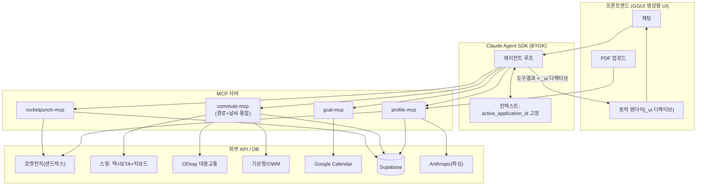

# PRD — "내일 아침까지 챙기는" 채용 커리어 에이전트 (GGUI Track)

> 코드네임: **JobPilot** (가칭) — GGUI 생성형 UI 기반 에이전틱 앱
> 작성: 2026-05-30 · 대회: Hashed · MarketFitLab 해커톤 (약 50팀) · 주력 트랙: **GGUI Track Award (1등 100만원)**

---

## 1. Summary (요약)

대화하면 화면이 실시간으로 만들어지는 **채용 에이전트**다. 이력서를 올리면 로켓펀치 공고를 매칭해 주고, 지원 현황을 추적하다가, 1차 면접에 합격하면 **면접 당일 통근 경로 + 날씨를 계산해 "비 오고 막히니 N분 일찍 출발하세요"라고 먼저 제안하고 구글 캘린더에 알림까지 자동 등록**한다. 핵심 차별점은 "공고 검색"에서 멈추는 다른 팀들과 달리, **사용자가 시키지 않은 다음 행동까지 선제적으로 처리**하는 데 있다.

---

## 2. Contacts (이해관계자)

> ⚠️ **솔로 참가** — 박찬성 1인이 전부 구현. 데모는 **1분**. 스코프를 그에 맞게 극단적으로 압축.

| 이름 | 역할 | 비고 |
|---|---|---|
| 박찬성 | 솔로 빌더(전부) | Claude Agent SDK·MCP 숙련, MONGSIL 패턴 재사용 |
| GGUI Track 담당 | Chloe / 문혜연 | 트랙 문의 |
| 임완섭 (wanseob@loqu.co) | GGUI 개발자 | 기술 컨택 |
| 허승균 이사 (010-3167-1501) | 스윙 | 현장 직통(5/31) |

---

## 3. Background (배경)

- 해커톤 후원 API: APIfuse, 젠랭크(AI 5종 추천 합의점수·무인증 공개 REST), 마이리얼트립, **로켓펀치(채용)**, 강남언니(의료), 스윙(모빌리티), tobl.ai, moat AI.
- **왜 지금**: GGUI가 `npx @ggui-ai/create-agentic-app@alpha` 부트스트랩 + MCP 호스팅 + 템플릿(에이전트코드+생성형UI+MCP예시+프론트)을 제공하면서, "복잡한 앱을 대화형으로 바꾸는" 에이전틱 앱을 1~2일 안에 만들 수 있게 됨.
- **왜 이 아이템**: 강남언니+마이리얼트립+스윙 조합은 "메디컬 투어"로 수렴해 **10~15팀이 같은 아이디어를 낼 레드오션**. 우리는 의도적으로 회피하고, 아무도 안 묶는 **채용 × 모빌리티 × 캘린더** 조합으로 차별화한다. 채용 검색은 "필터 20개·비교·지원추적"의 전형적 복잡 앱이라 GGUI 평가기준(복잡한 앱→에이전틱 전환)에 교과서처럼 맞는다.

---

## 4. Objective (목표)

### 목적
복잡하고 흩어진 구직·면접 준비 과정을 **하나의 대화 흐름**으로 합쳐, 사용자가 "검색→지원→면접 당일 도착"까지 신경 쓸 일을 에이전트가 대신 챙기게 한다.

### 핵심 결과 (해커톤 KPI — SMART)
| KR | 목표치 | 측정 |
|---|---|---|
| 데모 완주율 | 100% (중단 0회) | 라이브 시연 |
| 생성형 UI 컴포넌트 종류 | ≥ 6종 시연 | 잡카드/칸반/경로/날씨/출발플랜/캘린더 |
| 라이브 MCP 도구 호출 | ≥ 3종 실제 호출 | 로켓펀치/통근/캘린더 |
| 멀티턴 컨텍스트 유지 | 재입력 0회 | "이거/그 회사" 지시 성공 |
| 선제 제안(시키지 않은 액션) | ≥ 1회 | plan_departure 자동 카드 |

### 제품화 가정 시 KPI (참고)
주간 활성 구직자, 지원→면접 전환율, 면접 지각률 감소, 캘린더 등록 비율.

---

## 5. Market Segment (타깃)

- **1차 페르소나**: "이직 준비 중인 3년차 직장인". 여러 공고를 동시에 지원해 **현황 추적이 엉키고**, 낯선 회사 면접장 **통근/지각에 스트레스**를 받는다.
- **핵심 Job-to-be-done**: "여러 곳에 지원한 걸 한눈에 관리하고, 면접 당일 늦지 않게 도착하고 싶다."
- **제약**: 한국 채용/대중교통/날씨 데이터 기반(국내 우선). 개인 Gmail 캘린더 사용 가정.

---

## 6. Value Proposition (가치 제안)

| 고객의 Pain | 기존 방식 | JobPilot |
|---|---|---|
| 공고 찾기 번거로움 | 사이트 필터 클릭 노가다 | 대화 한 줄 → 잡카드 그리드 생성 |
| 지원 현황 엉킴 | 엑셀/머릿속 | 발화로 칸반 자동 갱신 |
| 면접 당일 지각 공포 | 직접 길찾기+날씨앱 따로 | 경로+날씨 합성, **선제 출발 제안** |
| 일정 까먹음 | 수동 캘린더 입력 | 알림 포함 자동 등록 |

**한 줄 메시지**: *"검색에서 멈추는 앱이 아니라, 면접 전날 밤 내일 아침을 통째로 세팅해 주는 에이전트."*

---

## 7. Solution (솔루션)

### 7.1 사용자 플로우 & 생성형 UI 매핑

| # | 사용자 발화 / 이벤트 | 호출 MCP 도구 | 생성 UI 컴포넌트 | GGUI 평가기준 |
|---|---|---|---|---|
| 1 | 이력서 PDF 업로드 | `parse_resume` | ProfileSummaryCard (편집가능) | ①즉시 시각화 ③MCP |
| 2 | "맞는 공고 찾아줘" | `match_jobs` | JobCardGrid (점수배지) | ①프로필 반응 ②연속성 |
| 3 | "프론트만 / 서울만" | `search_jobs` | JobCardGrid (필터칩, in-place 갱신) | ①발화로 UI 변형 |
| 4 | 카드 클릭 | `get_job` | JobDetailPanel | ①드릴다운 |
| 5 | "여기 지원했어" | (DB write) | KanbanTracker (지원중 칼럼 생성) | ①상태머신 ②추적 |
| 6 | "서류 합격했어" | (DB update) | KanbanTracker (칼럼 이동) | ②멀티턴 상태 |
| 7 | "1차 면접 6/5 오후2시" | (interview write) | InterviewFormCard→Kanban | ②면접↔지원 연결 |
| 8 | "면접날 어떻게 가? 날씨는?" | `get_commute`+`get_weather` | CommuteRouteCard + WeatherWidget | ①복합위젯 ③도구통합 |
| 9 | **(자동)** 출발시각 권장 | `plan_departure` | **DeparturePlanCard (빨강 하이라이트)** | ①의사결정카드 ③체이닝 |
| 10 | "캘린더에 넣어줘" | `get_oauth_url`→`create_event` | OAuthConnectCard→CalendarConfirmCard | ②플로우 종결 ③최종액션 |
| 11 | "내 지원현황 보여줘" | `list_events`/DB | KanbanTracker 전체 | ①종합뷰 |

> **멀티턴 일관성(평가기준 ②) 메커니즘**: 에이전트 컨텍스트에 `active_application_id`를 고정. 7~10번 발화는 회사명 없이도 직전 지원건을 자동 참조. 영속 뷰(칸반)는 Supabase를 단일 진실원천(SSOT)으로 두고, 화면은 항상 DB를 재투영.

### 7.2 핵심 기능 (Key Features)

1. **이력서→프로필 카드**: Claude 멀티모달로 PDF 직접 파싱(OCR 우회), JSON 스키마 강제 추출, 편집 가능 카드로 즉시 교정(human-in-the-loop).
2. **공고 매칭/검색**: 로켓펀치 래핑. 프로필 기반 추천(`match_jobs`) + 발화 필터(`search_jobs`). `apply_url` 평면화해 바로가기.
3. **지원 칸반 트래커**: applied / doc_passed / interview / final 4칼럼. 발화로 상태 변경.
4. **통근+날씨 합성 (클라이맥스)**: 경로(스윙 택시 ETA + 스윙 킥보드 + ODsay 대중교통) + 날씨(기상청/OWM)를 **하나의 타임라인 위젯**으로 합성. 택시·킥보드가 후원사 스윙 API라 멀티모달 비교가 전부 진짜 호출.
5. **선제 출발 플랜**: `plan_departure`가 면접 등록 직후 **사용자 요청 없이 자동** 카드 노출 — "강수확률 80% + 출근 혼잡 → 25분 일찍 출발 권장".
6. **구글 캘린더 자동 등록**: 일정 + 통근 요약 + 출발 알림(popup reminder) 등록.

### 7.3 기술 아키텍처

**런타임**: GGUI 템플릿 + **Claude Agent SDK** (BYOK, Anthropic 키). MCP 서버를 도구로 등록.

**생성형 UI 핵심 설계**: 모든 MCP 도구 반환을 `{ data, _ui }` 구조로. `_ui = { component, props, target: "replace|append" }` 디렉티브를 프론트가 해석해 동적 렌더. (이것이 평가기준 ①③를 직접 연결)

**MCP 도구 스펙 요약**
- `rocketpunch-mcp`: `search_jobs / get_job / search_events / search_posts`
- `commute-mcp`: `get_commute(origin,destination,arrival_time,modes)` / `get_weather(location,datetime)` / `plan_departure(...)` ← 내부에서 commute+weather 호출해 버퍼 계산. **택시=스윙 `/v1/taxi/eta`, 킥보드=스윙 `/v1/vehicles/search`, 대중교통=ODsay**. 모든 호출 전 `commute_cache` 조회(스윙 rate limit 30~60/min 보호)
- `gcal-mcp`: `get_oauth_url / create_event / list_events`
- `profile-mcp`: `parse_resume / match_jobs / save_profile`

**데이터 모델 (Supabase)**: `profiles`(스킬·경력·home_address) / `applications`(status enum) / `interviews`(scheduled_at·location·gcal_event_id) / `commute_cache`(jsonb, API 호출 절감).

### 7.4 API 실현가능성 (조사 결과 — 중요)

| API | 판정 | 셋업 | 비고 |
|---|---|---|---|
| **로켓펀치** | 조건부 | 즉시(샌드박스) | **0순위 작업**: 시작하자마자 키·스키마 확인. 응답 어댑터 + 고정 픽스처(JSON) 폴백 |
| **스윙 (SWING Playground)** | ✅ **가능 (후원사 공식)** | ~30분 | stage 환경, `X-API-KEY` 헤더. **택시 ETA + 킥보드 둘 다 진짜.** ⚠️stage라 응답이 mock 값일 수 있음(데모엔 오히려 안정적) |
| **ODsay 대중교통** | ✅ 가능 | 30분~1h | 무료 1,000/일. `searchPubTransPathT`. **대중교통 보강** |
| **기상청 단기예보** | 조건부 | 1~2h | 무료. **격자(nx/ny) 변환 + 디코딩키** 주의. POP는 3시간 단위 |
| **OpenWeatherMap** | ✅ 가능 | 10분 | 위경도만, 격자 불필요. **fallback 권장** |
| **Google Calendar** | 조건부 | 반나절 | **OAuth "Testing 모드" + 테스트 유저 등록** 필수. 개인 Gmail은 OAuth(서비스계정 불가). 폴백: `.ics` 생성 |
| **젠랭크 (옵션 +1)** | 검증필요 | 즉시 | 무인증 공개 REST. 빠르면 "AI 합의 입사추천 배지", 느리면 하드코딩 다운그레이드 |

**스윙 API 상세 (확정)**
- Base URL (stage): `https://stage.playground.endpoint.swingmobility.dev`
- 인증: HTTP 헤더 `X-API-KEY: <SWING_API_KEY>` — **키 값은 `.env`에만 보관**(문서 평문 기록 금지). 행사 참가자 공용, 종료 시 중단·보안서약
- `POST /v1/taxi/eta` — 출발·도착 좌표 → 예상 거리·시간·요금 (**60req/min 아님, 30req/min**)
- `POST /v1/vehicles/search` — 중심좌표·반경 → 주변 킥보드/자전거 목록 (60req/min)
- 초과 시 `429` + `Retry-After: 60` → **commute_cache 캐싱으로 보호 필수**
- Swagger: `https://stage.playground.endpoint.swingmobility.dev/swagger-ui/index.html`
- 현장 직통(5/31): 허승균 이사 010-3167-1501 / seunggyon@theswing.co.kr

> **실행 권고**: 시작 즉시 ① 로켓펀치 ② OWM ③ data.go.kr ④ Google Cloud 키 확보(승인대기 흡수). **택시·킥보드는 스윙(후원사) 진짜로 호출**, 대중교통은 ODsay 보강. 날씨는 기상청 주력 + OWM fallback. 스윙 stage가 mock 값을 줘도 `plan_departure` 버퍼 로직은 값에 무관하게 동작하도록 방어.

### 7.5 Assumptions (검증 필요한 가정)

- [ ] 로켓펀치 샌드박스에 데모용 공고 데이터가 충분히 있다 → **데모 전 실응답 1~2건 캡처**
- [x] ~~스윙 후원 API 제공 여부~~ → **확정. SWING Playground OPEN API 사용** (stage, X-API-KEY). stage가 mock 값일 수 있음만 유의
- [ ] 젠랭크 응답 속도/안정성 → **데모 전 1회 핑**
- [ ] GGUI 템플릿이 Claude Agent SDK + 커스텀 MCP 등록을 매끄럽게 지원

---

## 8. Release (릴리스 / 스코프)

### MoSCoW — 해커톤 1~2일

**Must (완성도 100%, 데모 필수)**
1. 생성형 UI 렌더러(_ui 디렉티브 해석)
2. ProfileSummaryCard (이력서→프로필)
3. JobCardGrid (로켓펀치 매칭/검색)
4. CommuteRouteCard + WeatherWidget (통근+날씨 합성)
5. **DeparturePlanCard 선제 제안 + CalendarConfirmCard (클라이맥스)**
6. 멀티턴 컨텍스트(active_application_id)

**Should**
- KanbanTracker (지원 추적)
- 젠랭크 AI 합의 배지

**Could**
- search_events/posts (회사 인사이트)
- 칸반 드래그앤드롭
- tobl.ai 연동

**Won't (이번엔 안 함)**
- 실제 지원서 자동 제출, 결제, 다국어, 모바일 네이티브

**시간 부족 시 컷 순서**: tobl.ai → 칸반 드래그 → 젠랭크 배지 → 로켓펀치 라이브(픽스처로) → 통근 라이브(캐시로) → **절대 안 버림: 생성형UI + 멀티턴 + 통근+날씨+캘린더 클라이맥스**

### 킬러 데모 대본 (⚠️ 1분 — 솔로/1분 제약)
1분 안에 "생성형 UI + 멀티턴 + 선제 클라이맥스"만 보여준다. 앞단(이력서/검색)은 **사전 세팅된 상태로 시작**하고, 라이브로는 클라이맥스 2턴만:
1. (0~10초) 화면엔 이미 잡카드+칸반(서류합격 상태). 한 줄: "1차 면접 6/5 2시" 입력 → 칸반 갱신 + 면접 등록
2. (10~40초) **(클라이맥스) 에이전트가 먼저** 통근+날씨 합성 카드 + 빨간 배너: "강수확률 80% + 출근 혼잡 → 15분 일찍 출발" (시키지 않은 선제 행동 = 빌더임팩트/창의성 점수)
3. (40~60초) "캘린더에 넣어줘" → 알림 포함 자동 등록 확인 카드 → 끝
> 발화는 사전 타이핑 스니펫 붙여넣기. 라이브 API(스윙 taxi/eta 등)는 직전 워밍업 1회 후 캐싱. 1분이라 앞 플로우는 녹화/사전상태로, 라이브는 클라이맥스에 집중.

### 리스크 Top 5 + 대응
| 리스크 | 대응 |
|---|---|
| 스코프 과다 | Must 6개만 100%, 나머지 mock. 컷 순서 사전 합의 |
| 로켓펀치 데이터 빈약 | 응답 어댑터 + 고정 픽스처 폴백, 데모 무중단 |
| 스윙 rate limit(택시 30/min) / stage mock 값 | `commute_cache` 캐싱으로 429 방어, 버퍼 로직은 값 무관하게 동작 |
| Google OAuth 셋업 지연 | Testing 모드 + 테스트 유저 사전 인증, `.ics` 폴백 |
| 데모 중 라이브 API 실패 | **mock 폴백 토글**(0.5~1초 타임아웃 후 무중단 전환) |

---

## 부록: 착수 0순위
1. **로켓펀치 샌드박스 키 확보 + 실응답 픽스처 캡처** (리스크 1 선제거)
2. OWM / data.go.kr / Google Cloud 키 일괄 신청 (승인대기 흡수). 스윙은 공용키를 `.env`(`SWING_API_KEY`)에 넣고 즉시 사용, Swagger로 요청/응답 필드 확인
3. `npx @ggui-ai/create-agentic-app@alpha` → Claude Agent SDK 선택 → To-do MCP 예시를 rocketpunch-mcp로 교체
이후 MCP 3종 병렬 개발 가능.
